  
  
  
  


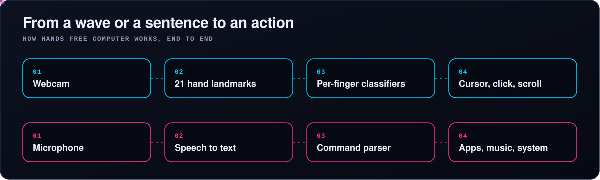

<h2 align="center">Things I've built</h2>

  <a href="https://github.com/anubrr21/handsfreecomputerassistant">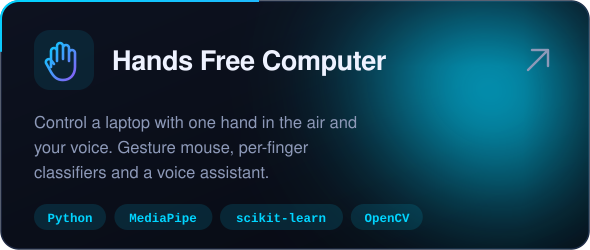</a>
  <a href="https://github.com/anubrr21/weatherGPT">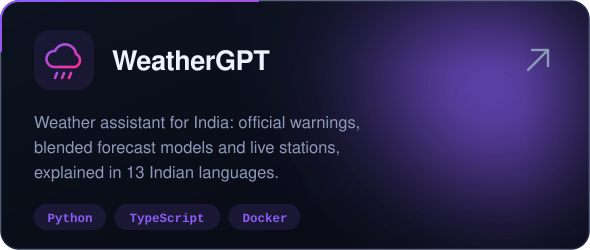</a>

  <a href="https://github.com/anubrr21/ITantra">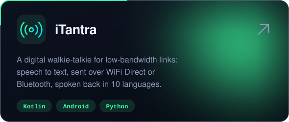</a>
  <a href="https://github.com/anubrr21/weatherRoute">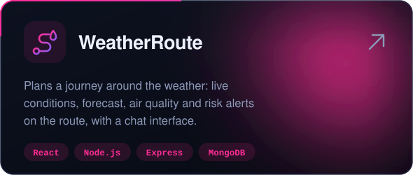</a>

  <a href="https://github.com/anubrr21/Studybud">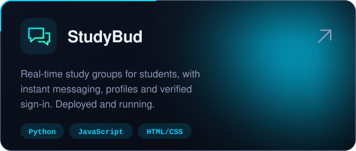</a>
  <a href="https://github.com/anubrr21/neetcode-submissions">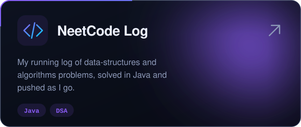</a>

<h2 align="center">Tools I work with</h2>

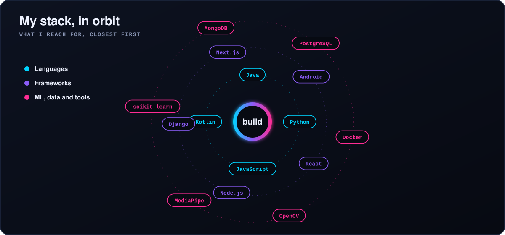

<h2 align="center">My year on GitHub</h2>

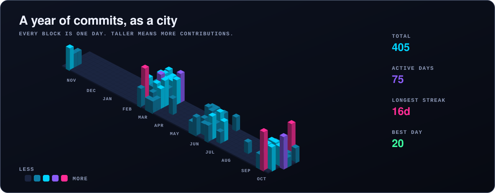


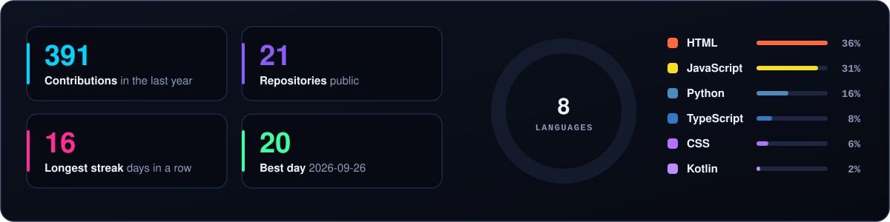


<picture>
  <source media="(prefers-color-scheme: dark)" srcset="assets/snake-dark.svg">
  
</picture>

Every graphic on this page is drawn by a script in this repository and redrawn daily from live GitHub data.

