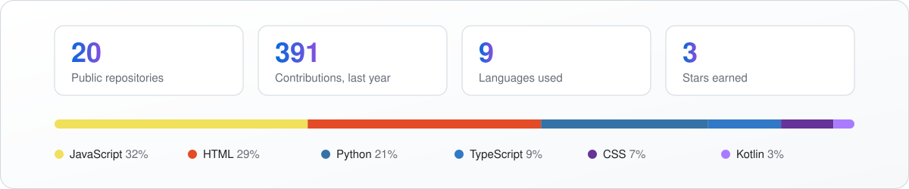

<picture>
  <source media="(prefers-color-scheme: dark)" srcset="assets/header-dark.svg">
  
</picture>

 

I'm a Computer Science undergraduate at VIT-AP University. I like building software that works with
the real world instead of a mouse and keyboard: programs that see a hand through a webcam, understand a
spoken sentence, or turn an official weather warning into something a person can act on. Most of what I
ship is a Python or Node backend with a React, Next.js or Android front end.

  
  
  

## What I'm building

<table>
  <tr>
    <td width="50%" valign="top">
      <h3><a href="https://github.com/anubrr21/handsfreecomputerassistant">Hands Free Computer</a></h3>
      Control a Windows laptop without touching it. A webcam tracks one hand for cursor, click, drag and
      scroll; a voice assistant opens apps, searches, and plays music. Per-finger classifiers are trained
      on your own hand in about a minute.
        
      <code>Python</code> <code>MediaPipe</code> <code>scikit-learn</code> <code>OpenCV</code>
    </td>
    <td width="50%" valign="top">
      <h3><a href="https://github.com/anubrr21/weatherGPT">WeatherGPT</a></h3>
      A weather assistant for India. It blends several global forecast models with live station readings
      and official IMD and NDMA warnings, then explains them in plain language, by text or voice, in 13
      Indian languages, including over SMS and voice calls.
        
      <code>Python</code> <code>TypeScript</code> <code>Docker</code>
    </td>
  </tr>
  <tr>
    <td width="50%" valign="top">
      <h3><a href="https://github.com/anubrr21/ITantra">iTantra</a></h3>
      A digital walkie-talkie for low-bandwidth links. The Android app turns speech into text, sends the
      text over WiFi Direct or Bluetooth instead of audio, and speaks it on the other phone, across 10
      Indian languages.
        
      <code>Kotlin</code> <code>Android</code> <code>Python</code>
    </td>
    <td width="50%" valign="top">
      <h3><a href="https://github.com/anubrr21/weatherRoute">WeatherRoute</a></h3>
      A travel assistant that plans a route around the weather: live conditions, a five-day forecast, air
      quality and weather-risk alerts along the way, with a conversational interface on top.
        
      <code>React</code> <code>Node.js</code> <code>Express</code> <code>MongoDB</code>
    </td>
  </tr>
  <tr>
    <td width="50%" valign="top">
      <h3><a href="https://github.com/anubrr21/Studybud">StudyBud</a></h3>
      A real-time communication platform for students: study groups with instant messaging, profiles
      and email-verified sign-in. <a href="https://studybud-kxsv.onrender.com">Open the live app</a>.
        
      <code>Python</code> <code>JavaScript</code> <code>HTML/CSS</code>
    </td>
    <td width="50%" valign="top">
      <h3><a href="https://github.com/anubrr21/neetcode-submissions">NeetCode submissions</a></h3>
      My running log of data-structures and algorithms problems, solved in Java.
        
      <code>Java</code> <code>DSA</code>
    </td>
  </tr>
</table>

## Tools I work with

  

  

  

## On GitHub

<picture>
  <source media="(prefers-color-scheme: dark)" srcset="assets/stats-dark.svg">
  
</picture>

  

<picture>
  <source media="(prefers-color-scheme: dark)" srcset="assets/snake-dark.svg">
  
</picture>

The header and statistics above are drawn by a script in this repository and refreshed daily from the GitHub API.
